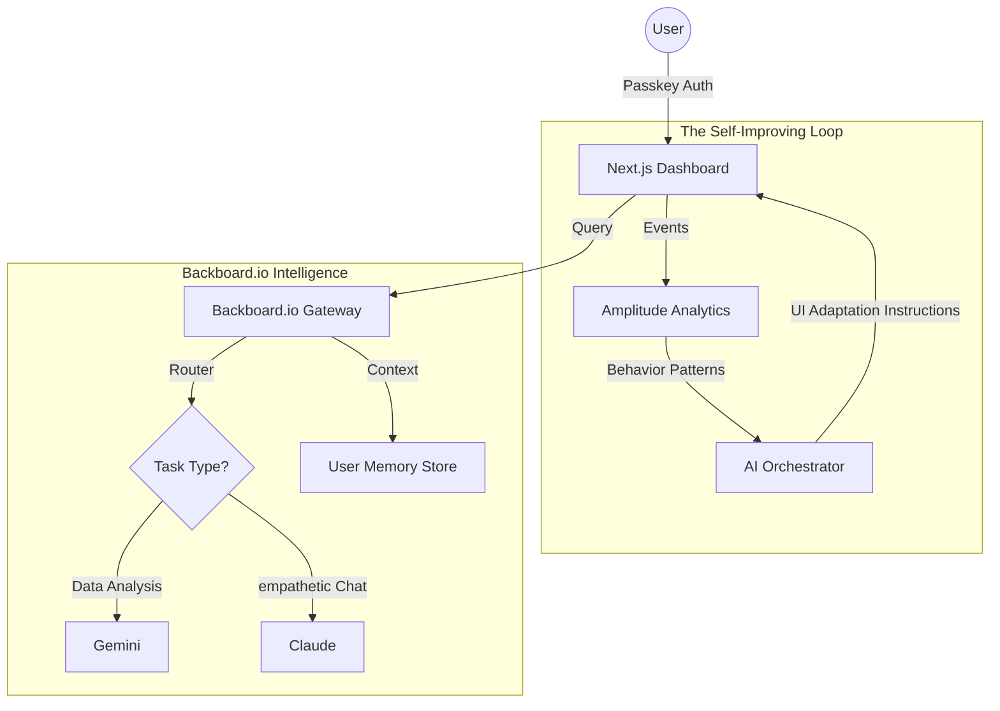

# IdentiFlow: The Adaptive Digital Identity Guardian

## 1. Project Overview & Theme: "Identity"

**IdentiFlow** is a "self-improving" digital identity dashboard that empowers users to own, understand, and secure their digital footprint.

In alignment with the **UofTHacks 2026 theme of "Identity"**, IdentiFlow moves beyond simple password management to create a holistic "Digital Mirror." It aggregates your online presence, analyzes your security behavior, and uses AI to actively guide you toward a stronger, more authentic digital self.

**The Core Loop:**
1.  **Observe:** Tracks how you interact with your security settings and digital assets (Amplitude).
2.  **Analyze:** Uses adaptive AI (Backboard.io) to understand your risk profile and learning style.
3.  **Act:** Dynamically adjusts the interface and recommendations to "nudge" you toward better security habits (1Password principles).

---

## 2. Sponsor Track Strategy

### 🏆 Amplitude: "Build Self-Improving Products"
**Goal:** Create a product that optimizes itself based on user behavior.
*   **Implementation:** We treat the dashboard as a living organism.
*   **Event Tracking:** We track granular events like `security_score_viewed`, `passkey_created`, `recommendation_ignored`, and `risk_scan_completed`.
*   **The "Loop":**
    *   *Input:* User consistently ignores "high urgency" security warnings.
    *   *AI Insight:* The user is overwhelmed by technical jargon.
    *   *Product Change:* The UI automatically switches from "Technical/Detailed" mode to "Simple/Action-Oriented" mode, reducing friction and increasing conversion on security tasks.

### 🔐 1Password: "Best Security Hack"
**Goal:** Creative, simple, and people-first security.
*   **Implementation:**
    *   **Passkeys First:** The entire app uses Passkey authentication (WebAuthn) for a passwordless, unphishable entry.
    *   **"Honest" Security:** We display a "Transparency Score" for every service linked, explaining exactly what data is exposed.
    *   **Simplicity:** Complex security audits are reduced to a single "Identity Health" visualizer.

### 🧠 Backboard.io: "Memory Lane: Adaptive AI Journeys"
**Goal:** Adaptive memory and multi-model switching.
*   **Implementation:**
    *   **Adaptive Memory:** The AI assistant ("Guardian") remembers context across sessions. If you asked about "phishing" last week, it prioritizes email security tips today.
    *   **Model Switching:**
        *   **Fast/Analytical (Gemini):** Used for scanning raw JSON data dumps from data breach APIs to find immediate threats.
        *   **Creative/Empathetic (Claude):** Used for the "Education Mode" chat, explaining security concepts in metaphors tailored to the user's background.

---

## 3. Implementation Plan & Timeline (36 Hours)

**Team Members:**
*   **Alice (Frontend Lead):** UI/UX, React, Tailwind, Data Visualization.
*   **Bob (Backend/Security Lead):** 1Password Integration, Passkeys, Secure API.
*   **Charlie (AI Lead):** Backboard.io Integration, Prompt Engineering, Model Switching Logic.
*   **Dave (Data Lead):** Amplitude Instrumentation, Event Schema, Feedback Loop Logic.

### **Phase 1: Foundation (Hours 0-8)**
*   **Alice:** Initialize Next.js project, setup Tailwind, design "Identity Health" dashboard layout.
*   **Bob:** Implement Passkey authentication (WebAuthn) and basic secure user session handling.
*   **Charlie:** Set up Backboard.io client, configure initial memory schemas for user preferences.
*   **Dave:** Define Amplitude event taxonomy (`User`, `Action`, `Context`) and set up the SDK.

### **Phase 2: Core Logic (Hours 8-20)**
*   **Alice:** Build the "Security Feed" and "Action Cards" UI components.
*   **Bob:** Mock external "Breach Data" APIs and integrate 1Password CLI/SDK concepts for credential management.
*   **Charlie:** Implement the **Model Switcher**:
    *   *Router:* If input contains "scan" -> use Gemini.
    *   *Router:* If input contains "explain" -> use Claude.
*   **Dave:** Implement the "Frustration Detector." If `click_velocity` > threshold (rage click) or `help_hover_duration` is high, trigger an AI intervention event.

### **Phase 3: The "Self-Improving" Loop (Hours 20-30)**
*   **Alice:** Create dynamic UI states (e.g., "Simplified Mode" vs "Expert Mode") triggered by state changes.
*   **Bob:** Ensure all data flow is encrypted and "honest" (visible logging to user).
*   **Charlie:** Refine Backboard memory: "Recall that the user prefers 'Gamified' security goals."
*   **Dave:** Wire up the Amplitude -> AI -> UI loop.
    *   *Logic:* `Events` -> `Amplitude Analysis` -> `AI Recommendation` -> `UI Update`.

### **Phase 4: Polish & Demo (Hours 30-36)**
*   **All:** End-to-end testing.
*   **Alice/Dave:** Polish the visual "Data Story" for the demo (showing the "before" and "after" AI adaptation).
*   **Bob/Charlie:** Verify Passkey flows and Model Switching distinctiveness.
*   **All:** Record demo video and write Devpost submission.

---

## 4. Architecture Diagram

