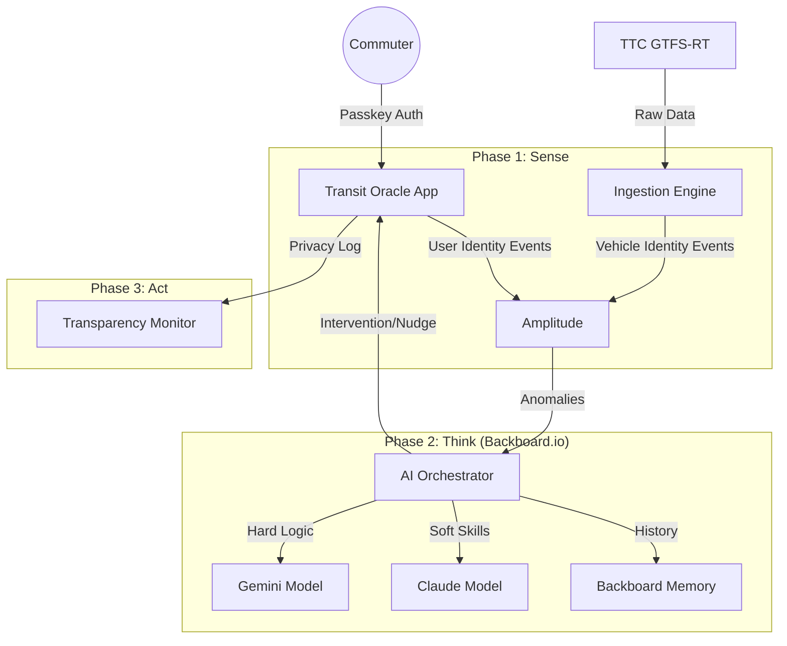

# Transit Oracle — The Self-Optimizing Urban Mobility Platform

A comprehensive research report and implementation blueprint for the **UofTHacks 2026** Challenge.

---

## 1. Project Overview & Theme: "Identity"

**Transit Oracle** creates a living "Digital Twin" of the city's transit network, assigning a unique **Digital Identity** to every vehicle and commuter.

In alignment with the **UofTHacks 2026 theme of "Identity"**, we explore two distinct concepts:
1.  **Infrastructure Identity:** We treat every bus and streetcar not as a static asset, but as a "User" with its own behavioral profile, "mood" (congestion level), and "health" (schedule adherence).
2.  **Commuter Identity:** We empower users to reclaim their commuting identity—shifting from passive passengers to active participants who can influence the network through feedback, while rigorously protecting their privacy.

**The Core Loop:**
1.  **Sense (Amplitude):** Ingest real-time telemetry (GTFS-RT) and user sentiment (rages taps).
2.  **Think (Backboard.io):** AI Agents analyze anomalies and "memory" of past gridlocks.
3.  **Act (Intervention):** Proactive nudges to reroute users *before* they get stuck.

---

## 2. Sponsor Track Strategy

### 🏆 Amplitude: "Build Self-Improving Products"
**Goal:** A product that observes behavior and optimizes itself.
*   **Implementation:** "The Network that Heals Itself."
*   **The "Vehicle as User" Hack:** We track vehicles as unique User IDs in Amplitude.
    *   *Event:* `vehicle_position_update` (Properties: `speed`, `occupancy`, `dwell_time`).
    *   *Insight:* Amplitude "Cohorts" automatically group vehicles into "Stalled" or "Smooth" clusters.
*   **The Loop:**
    *   *Input:* A streetcar "User" reports high dwell times at King & Spadina.
    *   *AI Action:* The app automatically flags this route segment as "High Friction" and updates the UI for *human* users to avoid it.

### 🔐 1Password: "Best Security Hack"
**Goal:** Simple, honest, people-first security.
*   **Implementation:**
    *   **Passkeys for Commuters:** Users authenticate via 1Password Passkeys. No typing complex passwords while running for the bus.
    *   **"Honest" Data Mode:** A prominent "Privacy Shield" toggle. When ON, the app explains exactly what location data is being used ("We see you are at Union Station to suggest a train, but we do not store this history").
    *   **Secure Anonymity:** We salt and hash user IDs before sending behavioral data to Amplitude, ensuring insights never compromise personal identity.

### 🧠 Backboard.io: "Adaptive AI Journeys"
**Goal:** Adaptive memory and multi-model switching.
*   **Implementation:**
    *   **The "Oracle" Agent:** A chatbot that answers "Why is my bus late?"
    *   **Model Switching Strategy:**
        *   **Analyst (Gemini):** Used for high-speed parsing of massive GTFS-RT JSON arrays to find anomalies.
        *   **Empathetic Guide (Claude):** Used to communicate bad news to the user (e.g., "The 504 is stuck, but don't worry, it looks like a 5-minute walk gets you to the subway.")
    *   **Memory:** The Oracle remembers your "Commute Stress Tolerance." If you previously rejected a crowded bus, it won't suggest "Standing Room Only" options again.

---

## 3. Executive Summary (Original Research)

Transit Oracle is a prototype for a "self-improving" urban mobility product that follows the Data → Insights → Action feedback loop. It combines real-time GTFS-RT telemetry (TTC), static infrastructure data (City of Toronto Open Data), and granular user behavioral analytics (Amplitude) to sense problems, generate insights with AI agents, and act (nudge users, surface bottlenecks, or trigger interventions).

## 4. The Paradigm Shift

Traditional transit apps passively display vehicle locations and ETAs. Transit Oracle treats the network as an instrumented system where both vehicles and commuters are first-class entities. The product continuously:

-   **Observes** (high-frequency telemetry + user events)
-   **Learns** (AI agents find causal patterns)
-   **Adapts** (reroutes, nudges, advocacy)

This lets the system proactively improve the commute experience rather than only informing users after the fact.

## 5. Phase 1 — Analytics (The Sensory System)

High-fidelity event instrumentation is the foundation.

### Digital-Twin Model

-   Treat vehicles as users (e.g., `vehicle_ttc_8421`) so we can use retention/funnel tools on assets.
-   Ingest GTFS-RT (vehicle positions, occupancy), signal location data, and user events into a unified Amplitude schema.

**Core Vehicle Events (Examples):**
-   `vehicle_position_update` — heartbeat (route_id, lat/lon, speed_kmh, occupancy_status, nearest_signal_id, dwell_time)
-   `service_anomaly_detected` — synthetic (anomaly_type, severity)

**Core User Events (Examples):**
-   `trip_plan_initiated` (origin/destination, time_of_day)
-   `route_selected` (predicted_duration, inferred crowding_tolerance)
-   `rage_tap` (rapid repeated taps — proxy for frustration)
-   `trip_abandoned` (location_at_dropoff, nearest_vehicle_id)

**Integration Architecture:** A FastAPI ingestion service polls GTFS-RT, enriches events with nearest-signal context, batches to Amplitude HTTP API v2, and deduplicates via `insert_id`.

## 6. Phase 2 — Analysis (The Cognitive System)

AI Agents (Orchestrator → Specialists) act as virtual data scientists:

-   **Metrics Agent** queries Amplitude metrics.
-   **Context Agent** synthesizes qualitative signals (rage taps, reports).
-   **Orchestrator** coordinates insight generation and action triggers.

**Example Insight: The Misery Index**

$$ 	ext{Misery Index} = 
\left( \frac{\text{Signal Dwell Time}}{\text{Total Run Time}} \right) \times \text{Crowding Multiplier} + \text{Frustration Factor} 
$$ 

Where *Crowding Multiplier* is a weight derived from `occupancy_status` and *Frustration Factor* comes from aggregated `rage_tap` frequency. Agents can detect "silent stalls" by correlating clusters of slow vehicles with user frustration spikes and emit `incident_detected` events.

## 7. Phase 3 — Action (Closing the Loop)

Actions driven by insights include:

-   **Dynamic Rerouting Nudges:** In-app guides or push notifications.
-   **Virtual Transit Signal Priority (vTSP):** Advocacy tool (collect votes for problem intersections).
-   **Natural-Language "Commute Doctor":** Chat to explain incidents and recommend alternatives.

*Example Nudge Message:*
> "Optimization Alert: The 504 is stalled at Bathurst. Walk 3 minutes north to take the 501 Queen — it's moving 40% faster."

---

## 8. Implementation Plan & Timeline (36 Hours)

**Team Members:**
*   **Alice (Frontend/Map Lead):** React Native (Expo), Mapbox GL, UI/UX.
*   **Bob (Data Engineer):** GTFS-RT Ingestion, Amplitude Instrumentation, Python Scripts.
*   **Charlie (AI Orchestrator):** Backboard.io Integration, Agent Logic, Prompt Engineering.
*   **Dave (Backend/Security):** FastAPI, Redis, 1Password Integration, Auth.

### **Phase 1: The Nervous System (Hours 0-8)**
*   **Alice:** Scaffolds the React Native app and integrates Mapbox to show a static city map.
*   **Bob:** Builds the `GTFS-Poller` service to fetch TTC data every 10s and normalize it.
*   **Charlie:** Initializes Backboard.io and defines the "Commute Context" memory schema.
*   **Dave:** Sets up the FastAPI backend and implements **1Password Passkey** auth for user signup.

### **Phase 2: The Digital Twin (Hours 8-20)**
*   **Alice:** Renders live vehicles on the map. Implements "Rage Tap" detection (rapid tapping on a delayed vehicle).
*   **Bob:** Wires the "Vehicle as User" logic. Every GTFS update sends an event to **Amplitude**.
*   **Charlie:** Implements **Model Switching**:
    *   *Router:* `if (task == "analyze_delay") use_model("gemini-flash");`
    *   *Router:* `if (task == "comfort_user") use_model("claude-3-5-sonnet");`
*   **Dave:** Implements the "Privacy Shield" logic to hash user data before it leaves the device.

### **Phase 3: The Intelligence Loop (Hours 20-32)**
*   **Alice:** Builds the "Intervention UI" – popups that suggest reroutes based on AI triggers.
*   **Bob:** Creates Amplitude Charts to visualize "The Misery Index" (Correlation of Dwell Time vs. User Rage Taps).
*   **Charlie:** Connects the **Backboard.io** agent to real-time data. The Agent can now "see" the delay Bob calculated and "speak" to the user.
*   **Dave:** Optimizes Redis caching to ensure real-time performance (latency < 200ms).

### **Phase 4: Polish & Deploy (Hours 32-36)**
*   **All:** "Simulate Chaos" test. We manually inject a "delay" into the system and verify:
    1.  Amplitude records the anomaly.
    2.  Backboard.io detects it.
    3.  The App notifies the user.
*   **Alice/Dave:** Record the demo, focusing on the "Privacy Shield" and "Passkey" login speed.
*   **Bob/Charlie:** Finalize the "Story" – how the City has an Identity.

---

## 9. Architecture Diagram



## 10. Strategic Differentiation

-   **Novel Identity Model:** Vehicles as users enables retention-shaped analytics on assets.
-   **Agent Orchestration:** Demonstrates autonomous analytics and technical depth.
-   **Equity Focus:** Misery Index by neighborhood highlights transit inequity.

## 11. Risks & Mitigations

-   **Rate Limits:** Batch events and only forward significant state changes (e.g., moved > 50m or occupancy change).
-   **Latency:** Use Redis for sub-second decisions and Amplitude for historic learning.

## 12. Conclusion

Transit Oracle is a blueprint for a commute that senses, reasons, and acts. By combining instrumentation, AI agents, and closed-loop interventions, the product demonstrably improves user outcomes and can be built as a hackathon prototype.

## 13. Appendix — Event Schema (JSON Examples)

### A. Infrastructure Event: `vehicle_position_update`

```json
{
  "user_id": "bus_vehicle_8421",
  "device_id": "gps_tracker_8421",
  "event_type": "vehicle_position_update",
  "time": 1735732800000,
  "event_properties": {
    "route_number": "504",
    "direction": "Eastbound",
    "latitude": 43.6452,
    "longitude": -79.3806,
    "speed_kmh": 3.2,
    "congestion_level": "STOP_AND_GO",
    "occupancy_status": "STANDING_ROOM_ONLY",
    "nearest_signal_id": "PX_291",
    "delay_vs_schedule_seconds": 340
  },
  "insert_id": "veh_8421_1735732800000"
}
```

### B. User Event: `trip_friction_detected`

```json
{
  "user_id": "user_hash_99a",
  "event_type": "trip_friction_detected",
  "event_properties": {
    "trigger": "rage_tap_cluster",
    "click_velocity": 8,
    "current_route_context": "504_King",
    "associated_vehicle_occupancy": "CRUSHED_STANDING_ROOM_ONLY",
    "misery_index_score": 9.2
  }
}
```

### C. Agent Action: `intervention_generated`

```json
{
  "user_id": "user_hash_99a",
  "event_type": "intervention_generated",
  "event_properties": {
    "intervention_type": "reroute_suggestion",
    "suggested_route": "501_Queen",
    "reason": "silent_stall_detected",
    "estimated_time_saved_minutes": 14
  }
}
```